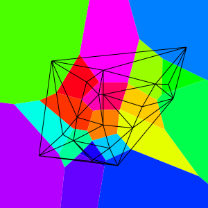

# Pixienator
Helpers for visualizing [Delaunator](https://github.com/patternspandemic/delaunator-nim) with [Pixie](https://github.com/treeform/pixie).

`nimble install pixienator`

[API Reference](https://patternspandemic.github.io/pixienator/) - A work in progress.

### Features
- Path generating templates for various parts of the Delaunator datastructure.

### Example
```nim
import std/[random, sugar]
import delaunator, delaunator/helpers, pixie, pixienator

var
  width = 300
  height = 300
  image = newImage(width, height)

  # Generate a normal distribution of 20 points.
  siteCount = 20
  normalPoints = collect(newSeq):
    for i in 1 .. siteCount: [gauss(width.float64 / 2.0, width.float64 / 6.0), gauss(height.float64 / 2.0, height.float64 / 6.0)]

  # Create the dual graph.
  d = delaunator.fromPoints[array[2, float64], float64](normalPoints)


# Clip infinite regions to match our image size.
d.bounds = (0.0, 0.0, width.float64, height.float64)

let # Use some Pixienator helpers to generate Pixie Paths:
  triangulation = pathForTriangleEdges(d)
  voronoi = pathsForRegions(d)

# Color each region.
for i, region in voronoi.pairs:
  image.fillPath(region, spin(color(1.0, 0.0, 1.0), i.float64 * (360.float64 / voronoi.len.float64)))

# Draw the triangulation on top.
image.strokePath(triangulation, "black")

image.writeFile("example.png")

```

